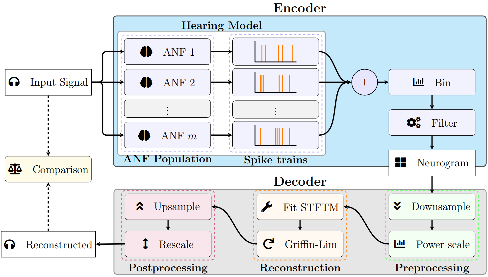

# 🧠 NeuroVoc: From Spikes to Speech 🔊

[](https://arxiv.org/abs/2506.03959)  
*A biologically plausible vocoder for auditory perception modeling and cochlear implant simulation.*

---

## 🔍 Overview

**NeuroVoc** is a flexible, biologically inspired vocoder that reconstructs audio signals from simulated auditory nerve activity. It is designed to support both **normal hearing (NH)** and **electrical hearing (EH)** models, allowing for a seamless comparison of auditory perception under different hearing conditions.



### 🧭 Diagram Explanation

The diagram above illustrates the NeuroVoc processing pipeline:

1. **Sound** — An input waveform (e.g., speech) is passed to an auditory model.
2. **Hearing Model** — This model (e.g., normal hearing or cochlear implant simulation) transforms the sound into a neural representation.
3. **Neurogram** — The output is a time–frequency matrix of spike counts, simulating auditory nerve activity.
4. **Decoder** — The neurogram is then converted back into an acoustic waveform using an inverse short-time Fourier transform (STFT)-based decoder.

This modular flow enables the flexible substitution of different models or model parameters while maintaining a consistent reconstruction backend.

---

## 📁 Repository Structure

```
neurovoc/
├── neurovoc/               # Core vocoder framework (Python package)
├── experiments/            # Scripts for generating the figures from the paper
├── data/                   # Din test data and paper data
├── tests/                  # Unit tests
```

The main package can be found in the neurovoc folder. Experiments holds the notebooks that were used to generate the plots in the paper. The online Digits in Noise test platform, can be found in [this](https://github.com/jacobdenobel/dinweb) repository. 

---

## 🚀 Getting Started

### 1. Clone the repository

```bash
git clone https://github.com/jacobdenobel/neurovoc.git
cd neurovoc
```

### 2. Install 

```bash
pip install .
```

---

## 💻 Command Line Interface (CLI)

NeuroVoc provides a flexible CLI for simulation and vocoding. Once installed, you can use the `neurovoc` command. If you want to know more about a command, or see which options are available, add the `--help` flag. For example: 

```bash
    neurovoc generate bruce --help
```

### 🔧 Generate a Neurogram
These commands take an audio waveform and convert it into a neurogram (neural spike representation):

```bash
neurovoc generate bruce input.wav output.pkl
neurovoc generate specres input.wav output.pkl
neurovoc generate ace input.wav output.pkl
```

Each model supports its own optional flags, like `--n-fibers-per-bin`, `--n-mels`, or `--version` for ACE. 

### 🎧 Reconstruct Audio from Neurogram
Converts a saved neurogram back into an audio waveform using an inverse STFT-based decoder. Use options like `--n-hop`, `--n-fft`, or `--target-sr` to control reconstruction parameters. 

```bash
neurovoc reconstruct output.pkl reconstructed.wav
```

### 🧪 Full Vocoder Run (Simulate + Reconstruct)
These commands run a full simulation + reconstruction cycle in one go:
```bash
neurovoc vocode bruce input.wav output.wav
neurovoc vocode specres input.wav output.wav
neurovoc vocode ace input.wav output.wav
```

Add `--plot` to visualize original vs reconstructed signal.

---

## 🧠 Citation

If you use NeuroVoc in your work, please cite the following:

```bibtex
@misc{denobel2025spikesspeechneurovoc,
    title={From Spikes to Speech: NeuroVoc -- A Biologically Plausible Vocoder Framework for Auditory Perception and Cochlear Implant Simulation}, 
    author={Jacob de Nobel and Jeroen J. Briaire and Thomas H. W. Baeck and Anna V. Kononova and Johan H. M. Frijns},
    year={2025},
    eprint={2506.03959},
    archivePrefix={arXiv},
    primaryClass={cs.SD},
    url={https://arxiv.org/abs/2506.03959}, 
}
```

---

## 📫 Contact

For questions or feedback, contact [nobeljpde1@liacs.leidenuniv.nl](mailto:nobeljpde1@liacs.leidenuniv.nl)  
Or open an issue in this repository.

---

## 🛠 License

This project is licensed under the **MIT License**. See the [LICENSE](LICENSE) file for details.
